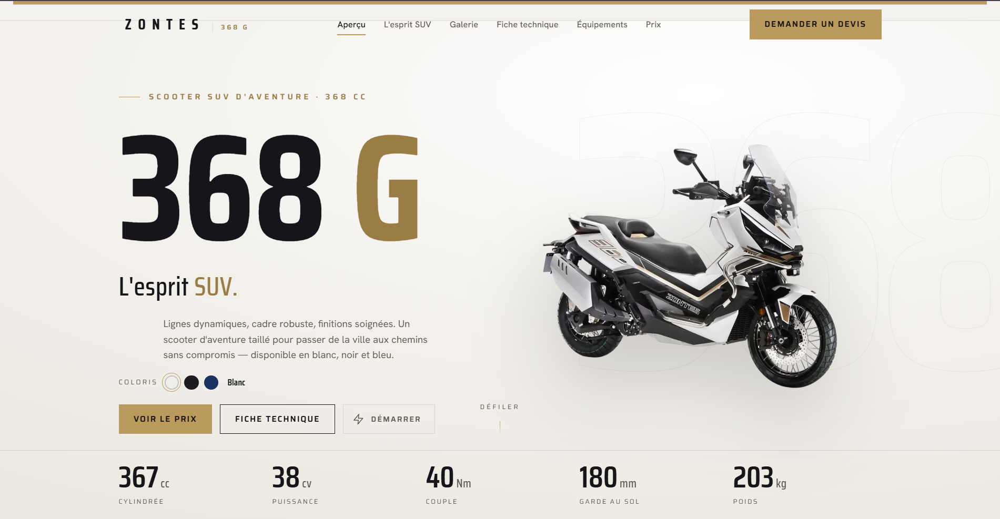
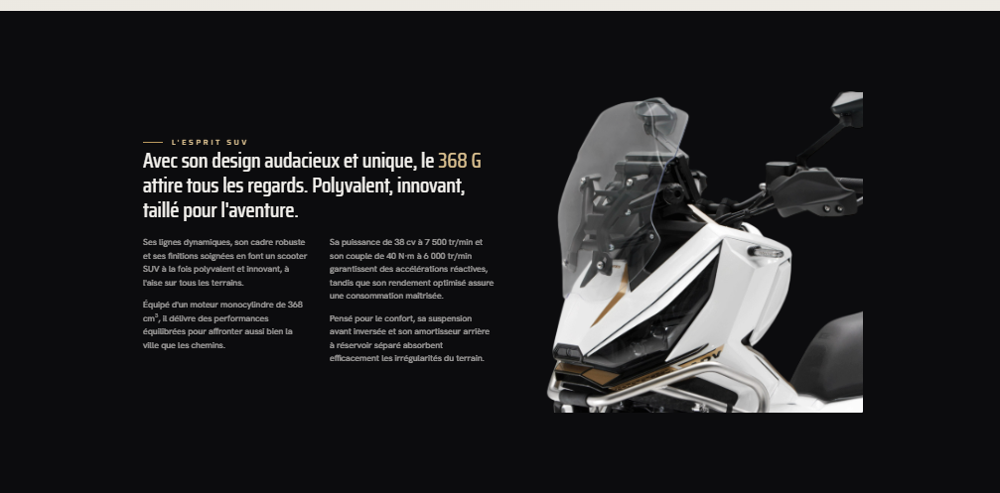

<div align="center">

# ZONTES 368 G — Tunisie

**Page produit officielle · Scooter SUV d'aventure 368 cc**

[](https://react.dev)
[](https://typescriptlang.org)
[](https://vitejs.dev)
[](https://vercel.com)

</div>

---

## Aperçu



> Page marketing single-page, **mobile-first**, haute performance pour le Zontes 368 G sur le marché tunisien.  
> Prix public : **29 000 TND TTC** · Coloris : **Blanc · Noir · Bleu**

---

## Captures d'écran

### Hero — Sélecteur de coloris & statistiques


La section héro affiche le véhicule en grand format avec un sélecteur de coloris dynamique (Blanc, Noir, Bleu) qui met à jour l'image instantanément. Les 5 stats clés (cylindrée, puissance, couple, garde au sol, poids) s'affichent en bas de section.

---

### L'esprit SUV — Section dark immersive



Section sur fond noir avec le véhicule flottant sur fond transparent. Le texte commercial met en valeur la polyvalence et les performances du 368 G avec une mise en page 2 colonnes.

---

## Fonctionnalités

| Fonction | Détail |
|---|---|
| 🎨 **Sélecteur coloris** | Blanc · Noir · Bleu — mise à jour Hero + Esprit + Galerie simultanément |
| 🖼️ **Galerie 360°** | 8 angles par couleur (24 photos), navigation prev/next + miniatures |
| 🔊 **Son moteur** | Bouton ignition avec animation pulsée gold, `engine.mp3` natif |
| 📱 **Mobile-first** | Breakpoints 640 px (tablette) et 980 px (desktop), hamburger menu |
| ✨ **Reveal on scroll** | `IntersectionObserver` — fade-up à 0.1 threshold, délais décalés |
| 🔍 **SEO complet** | JSON-LD Product + FAQ + Organization, Open Graph, sitemap.xml |
| ⚡ **Performance** | Preload hero image, lazy loading galerie, `fetchPriority="high"` |
| 📊 **Fiche technique** | 4 blocs de specs structurés depuis `data/specs.ts` |
| 🛡️ **Pack équipements** | 8 équipements de série avec icônes SVG inline |
| 💰 **Section prix** | Tarif 29 000 TND TTC avec flag Tunisie et checklist |

---

## Stack

```
React 18 + TypeScript 5
Vite 5           → build < 1s, HMR instantané
CSS Modules      → styles scopés par composant
IntersectionObserver → animations scroll vanilla (0 dépendance)
Web Audio API    → son moteur natif
Vercel           → déploiement continu depuis GitHub
```

---

## Structure du projet

```
zontes-site/
│
├── public/
│   ├── images/
│   │   ├── white/          # 8 angles blanc — PNG sans fond
│   │   ├── black/          # 8 angles noir  — PNG sans fond
│   │   ├── blue/           # 8 angles bleu  — PNG sans fond
│   │   └── assets/         # Détails : phare · roue · selle · réservoir
│   ├── sounds/
│   │   └── engine.mp3
│   ├── robots.txt
│   └── sitemap.xml
│
├── src/
│   ├── data/
│   │   ├── colors.ts       # 3 coloris — images hero + esprit + 8 vues galerie
│   │   ├── features.ts     # 4 points forts (Feature type)
│   │   └── specs.ts        # Fiche technique (SpecBlock[])
│   │
│   ├── components/
│   │   ├── Nav.tsx / .module.css
│   │   ├── Hero.tsx / .module.css
│   │   ├── Esprit.tsx / .module.css
│   │   ├── Features.tsx / .module.css
│   │   ├── Gallery.tsx / .module.css
│   │   ├── Specs.tsx / .module.css
│   │   ├── Equipment.tsx / .module.css
│   │   ├── Pricing.tsx / .module.css
│   │   ├── Footer.tsx / .module.css
│   │   ├── SoundButton.tsx / .module.css
│   │   └── Reveal.tsx
│   │
│   ├── styles/
│   │   └── global.css      # Design tokens CSS custom properties
│   ├── App.tsx             # État coloris global → props
│   └── main.tsx
│
├── docs/
│   ├── hero.png
│   └── esprit.png
├── index.html              # SEO complet — JSON-LD · OG · meta
└── vercel.json
```

---

## Lancer le projet

```bash
# 1 — Cloner
git clone https://github.com/Aymenjallouli/Zontes368G_Tunisie.git
cd Zontes368G_Tunisie

# 2 — Installer
npm install

# 3 — Développement
npm run dev
# → http://localhost:5173

# 4 — Build production
npm run build

# 5 — Prévisualiser le build
npm run preview
```

---

## SEO

### Schémas JSON-LD inclus

| Schéma | Impact Google |
|---|---|
| `Product` | Prix, specs moteur, couleurs indexés dans Google Shopping |
| `FAQPage` | **5 questions** affichées en rich snippets dans les résultats |
| `Organization` | Fiche distributeur Tunisie |
| `WebPage` + `BreadcrumbList` | Navigation enrichie dans les SERPs |

### Meta tags
```
<title>Zontes 368 G — Scooter SUV 368cc | Prix 29 000 TND | Tunisie</title>
<meta name="description" content="38 cv · 40 Nm · fourche 41 mm · TFT 8&quot; · ABS · 29 000 TND TTC">
<meta property="og:type" content="product">
<meta name="geo.region" content="TN">
```

### Sitemap XML avec image sitemap
`/sitemap.xml` — indexe toutes les photos produit pour Google Images.

> ⚠️ Remplacer `https://zontes-tunisie.tn` par le vrai domaine dans `index.html`, `sitemap.xml` et `robots.txt`.

---

## Design tokens

| Token | Valeur | Rôle |
|---|---|---|
| `--pearl` | `#f4f2ee` | Fond sections claires |
| `--black` | `#0c0c0e` | Fond sections sombres |
| `--gold` | `#bb9a5e` | Accent principal |
| `--gold-bright` | `#d8be8e` | Or sur fond sombre |
| `--gold-deep` | `#9a7d45` | Or sur fond clair |
| `--ink-soft` | `#5f5b53` | Texte secondaire |
| `--ease` | `cubic-bezier(.22,.61,.36,1)` | Easing global |

**Typographie :** Saira Condensed (titres display) · Hanken Grotesk (corps)

---

## Déploiement Vercel

Le projet se redéploie automatiquement à chaque `git push` sur `main`.

```bash
# Déploiement manuel
vercel --prod
```

---

*Caractéristiques et prix non contractuels, susceptibles d'évoluer sans préavis.*  
*Document destiné au réseau revendeurs & distributeurs — Tunisie.*
